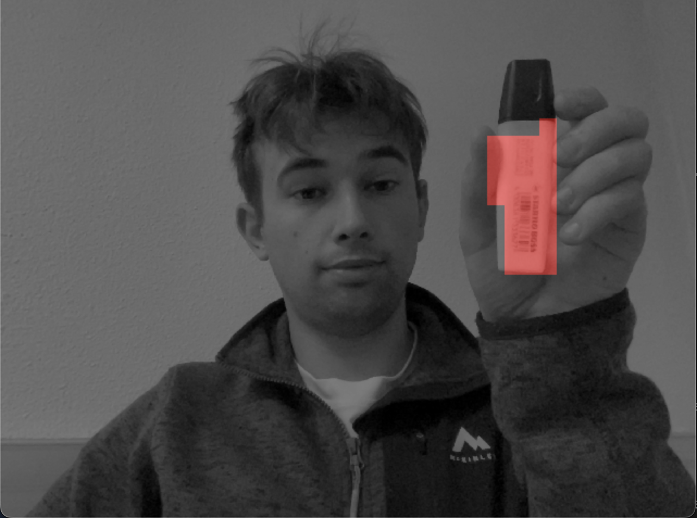
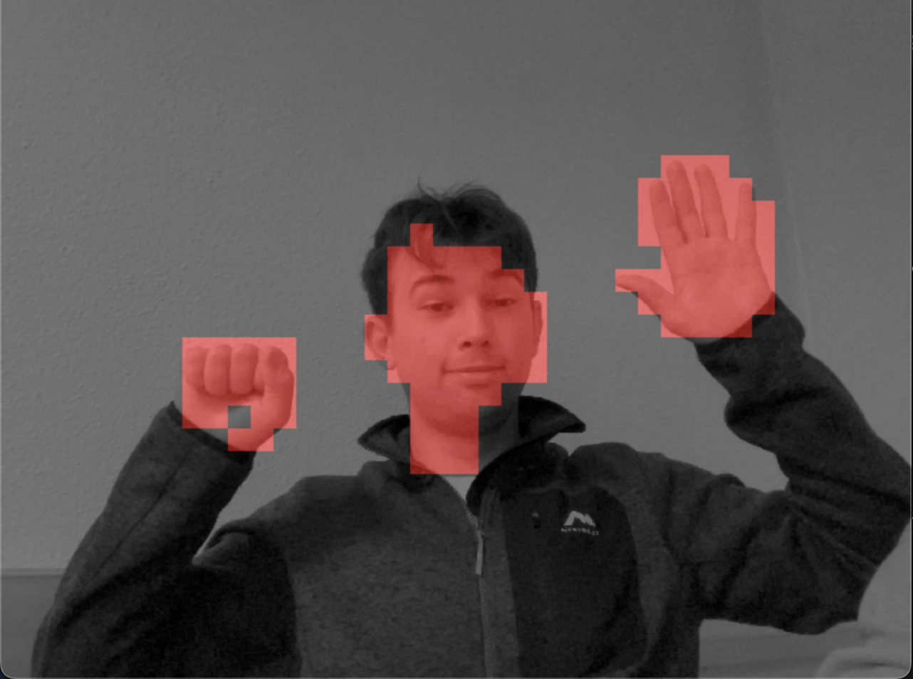
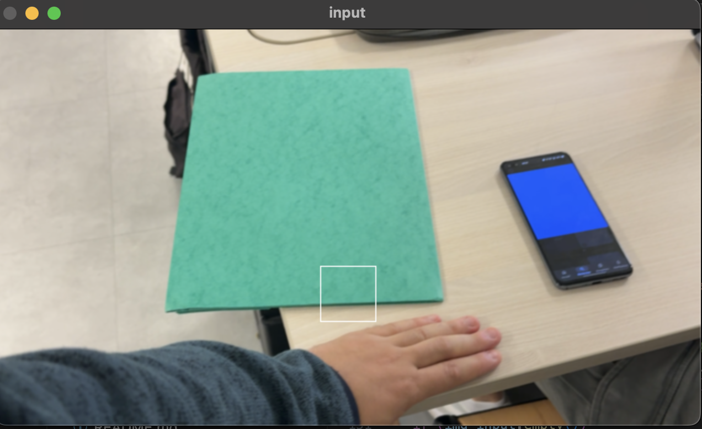
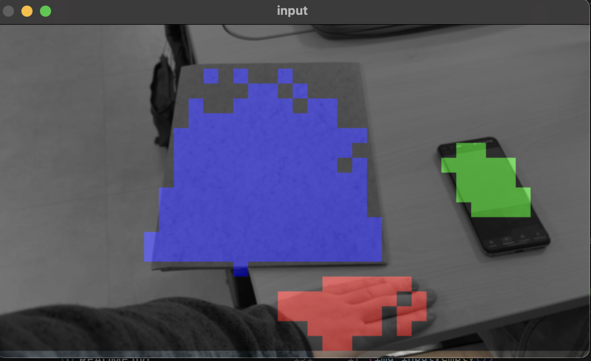
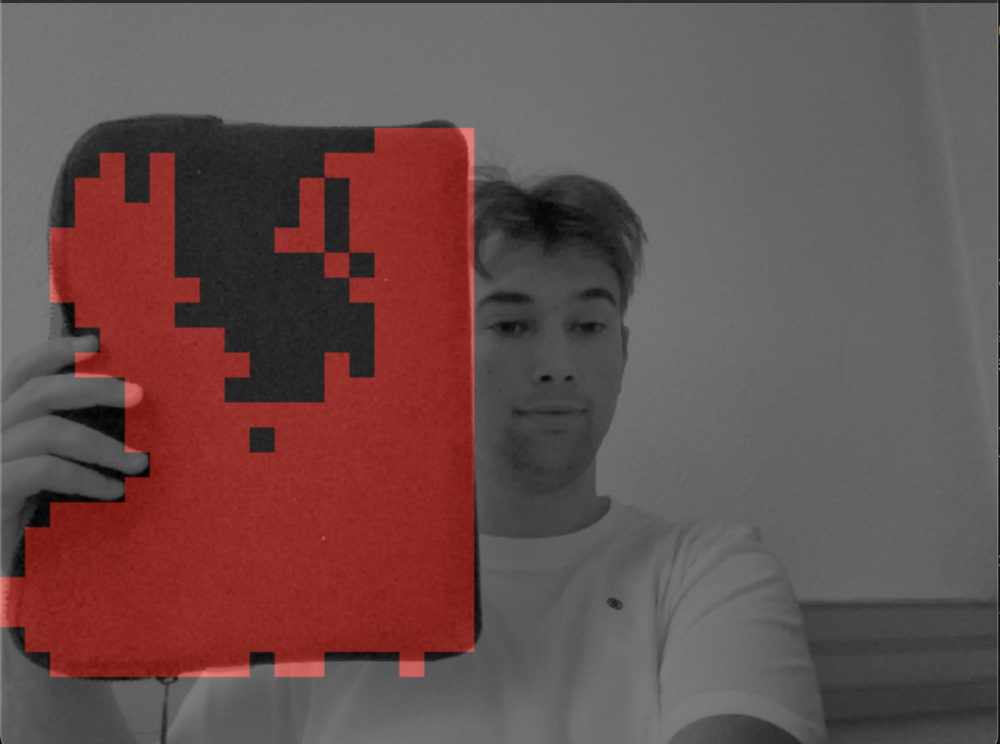
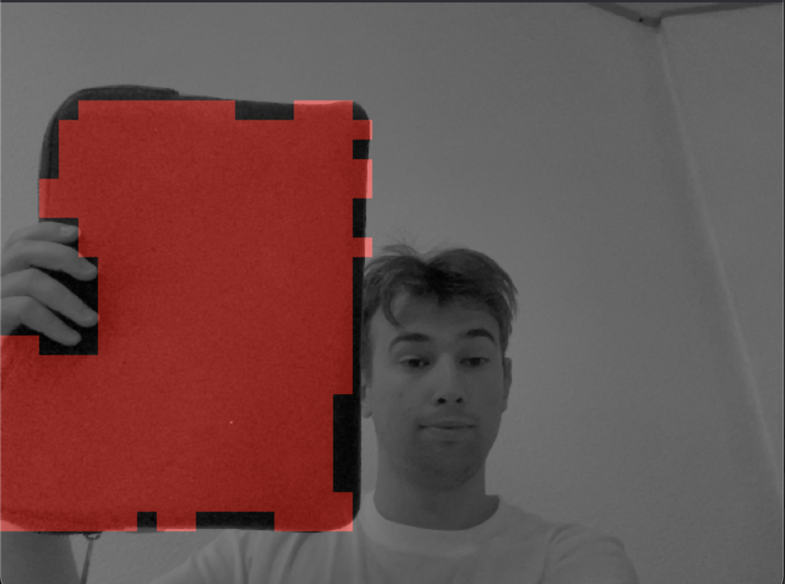
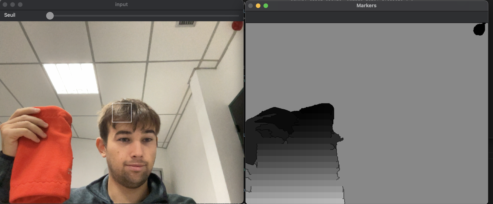

# TPINF911_DESBOS_GRIVA

Pour compiler:

    mkdir build
    cd build
    cmake -DCMAKE_BUILD_TYPE=Release ..
    make

Pour exécuter:

    ./main

# Compte rendu

Pour calculer la distance, on a utilisé x2Chi-2 comme ci-dessous:

    for (int i = 0; i < 8; i++)
      for (int j = 0; j < 8; j++)
        for (int k = 0; k < 8; k++)
          if (data[i][j][k] + other.data[i][j][k] > 0)
            dist += (pow((data[i][j][k] - other.data[i][j][k]), 2)) / (data[i][j][k] + other.data[i][j][k]);

## Mode reconnaissance objet

Nous avons commencé par faire la reconnaissance d'un seul objet.
En chossisant un background (touche 'b'), puis un objet de couleur (touche 'a'), on peut le reconnaitre dans le flux video (touche 'r')

<table>
  <tr>
    <td>Reconnaissance d'un surligneur jaune</td>
     <td>Reconnaissance de la peau</td>
  </tr>
  <tr>
    <td></td>
    <td></td>
  </tr>
 </table>

## Mode reconnaissance de plusieurs objets

Pour reconnaitre plusieurs objets, on a ajouté un tableau d'histogrammes qui stocke les différents histogrammes des objets reconnus.

<table>
  <tr>
    <td>Image sans reconnaissance</td>
     <td>Reconnaissance activé</td>
  </tr>
  <tr>
    <td></td>
    <td></td>
  </tr>
 </table>

## Optimisation

### Seuil

Afin d'otimiser le programme, on a ajouté un seuil pour la distance entre les histogrammes. Si la distance est inférieure à ce seuil, on considère que l'objet n'est pas utiles à ajouter. Pour cela on a ajouté une trackbar pour ajuster le seuil.

<table>
  <tr>
    <td>Trackbar pour ajuster le seuil</td>
     <td>Retour du terminal</td>
  </tr>
  <tr>
    <td></td>
    <td></td>
  </tr>
 </table>

### Relaxation des labels

Afin d'avoir une meilleure analyse des couleurs, on a appliqué une relaxation des labels trouvés en utilisant un voisinnage 3x3.
Cela permet de lisser les résultats en changeant les labels des pixels qui ne sont pas dans la majorité des voisins.

<table>
  <tr>
    <td>Image sans relaxation</td>
     <td>Image avec relaxation</td>
  </tr>
  <tr>
    <td></td>
    <td></td>
  </tr>
 </table>

## CMI

### Amélioration de la reconnaissance

Afin d'améliorer la reconnaissance des objets et avoir un meilleur suivi en temps réel lorsque l'objet bouge, nous avons exploité la cohérence temporelle des objets. Pour cela on a mis en place un flot optique. Il permet de mesurer le déplacement des pixels d'une image à une autre. On récupère donc les déplacements et on peut ensuite ajuster les blocs en conséquence pour améliorer la robustesse de la reconnaissance.

### Ajout des marqueurs waterhsed

Pour améliorer la reconnaissance des objets, on a ajouté des marqueurs watershed pour délimiter les objets. Cela permet de mieux les identifier et de les suivre. On calcul les marqueurs et on les affiches dans une image à part.

Il faudrait ensuite ajouter ces marqueurs dans la fonction de reconnaissance pour améliorer la détection des objets.

<table>
  <tr>
    <td> Reconnaissance / marqueur watershed </td>
  </tr>
  <tr>
    <td></td>
  </tr>
 </table>

### Ajout de la sauvagarde des objets

On peut sauvegarder le fond et un objet, puis les charger pour les comparer les optimisations. On ne peut sauvegarder qu'un seul objet à la fois pour l'instant (On charge les histogrammes avec la touche 'l'.).
Pour sauvegarder, on utilise des fichier .txt dans lesquels on stocke les histogrammes des objets.

